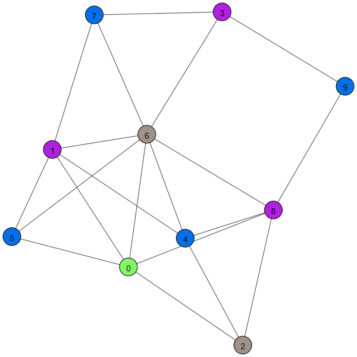

## 问题

### 问题背景

图染色问题是计算机科学和图论中的一个经典问题, 其应用背景涉及到许多领域, 包括网络通信、地图着色、资源分配、任务调度等。它是一个NP-hard问题, 因此通常采用求解器或者一些启发式算法。

### 形式定义

首先, 其判断形式的问题形式化定义如下。  
对一个图$G$, 一个染色数$c$, 我们说$G$是$c$色可染的, 当且仅当存在一个染色方案$f:V(G)\rightarrow [c]$, 使得$\forall (u,v)\in E(G), f(u)\neq f(v)$.  
图的色数就定义为$\chi(G)=\min_c[G是c色可染的]$。

## 编码

我们将其编码为一个CNF范式。我们总共需要$vc$个变量来描述这一问题, 其中$x_{i,j}$为真就意味着将第$i$个结点染第$j$个颜色。  
自然的, 我们可以给出这个问题的等价约束如下

$$
\begin{align*}
\bigvee_{j\in[c]} x_{i,j}, \forall i\ \ &\text{每个节点至少分配一个颜色}\\
\neg(x_{i,k}\wedge x_{i,j}), \forall i,k<j\ \ &\text{每个结点至多分配一个颜色}\\
\neg(x_{u,k}\wedge x_{v,k}),\forall (u,v)\in E(G), k\ \ &\text{邻点颜色不同}
\end{align*}
$$

在后两行应用德摩根律后就得到了CNF范式

$$
\begin{align*}
&\bigwedge_{i\in V}(\bigvee_{j\in[c]} x_{i,j})\\
&\wedge\bigwedge_{i\in V,k<j}(\neg x_{i,k}\vee \neg x_{i,j})\\
&\wedge\bigwedge_{(u,v)\in E, k\in [c]}(\neg x_{u,k}\vee\neg x_{v,k})
\end{align*}
$$

## 例子

在代码中编写了样例生成模块.作为样例,当点数和边数分别为$n=10,m=20$时, 生成样例如下。  
  
使用求解器求解, 给出的结果如下

```
data prepared.  
graph G IS NOT 1-colorable  
graph G IS NOT 2-colorable  
graph G IS NOT 3-colorable  
graph G IS 4-colorable  
\chi(G)=4  
a legal coloring scheme is  
[(0, 3), (1, 1), (2, 2), (3, 1), (4, 0), (5, 0), (6, 2), (7, 0), (8, 1), (9, 0)]
```

可以看到, 当$c=1,2,3$时对应的SAT问题都是不可满足的, 而当$c=4$时可满足, 其给出的染色方案图示如下, 因此$\chi(G)=4$。我们容易验证$c=3$的情况是无法满足的（比如考虑首先对028三点组成的三角形做任意初始染色, 后将与其接触的三角形依次染色即可发现矛盾）  


## 具体实现

使用python语言编写代码, SAT求解器使用了pysat库, 绘图则使用了igraph库。  
代码见/src文件夹, 其中`main.py`是主函数为入口, `data_gen.py`用于生成数据, `problem_convert.py`用于将图染色问题转为CNF范式, `graph_drawing.py`用于绘图。